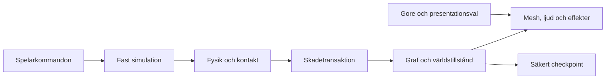

# Motor och arkitektur för PC-webb och Windows

**Beslutsförslag:** behåll Three.js/TypeScript som kapitelplattform genom P0-proven. Jämför en begränsad Rapier-adapter med Jolt innan en hel motor ersätts. Behåll en fysikvärld för NPC:er, rekvisita och kastade delar; en Rapier/Jolt-delning skulle kräva ett eget kontakt- och impulsutbyte och försvåra reproducerbarhet.

Underlaget jämför dokumenterad funktion och faktisk lokal kod. Inget jämförelsebygge har körts i Godot, Unity, Unreal eller Jolt. Kvalitets-, minnes- och iterationstidsskillnader är därför testfrågor, inte uppmätta rankingtal.

## Kravstyrd matris

| Krav | Three.js + Rapier, nuvarande | Godot | Unity | Unreal |
|---|---|---|---|---|
| Lokal PC-webb och Windows | Samma TS-regler och Three-renderer i browser/Electron; teknikgård finns. | Officiella exporter till båda. Webb använder Compatibility/WebGL 2, med språk- och ljudbegränsningar. | Officiella Windows- och webbyggen; webplattformen har separata begränsningar. | Stark Windows-export. Ingen aktuell officiell UE5-export för motsvarande lokalt webspel verifierad. |
| Begränsad ragdoll | Grundläggande rigid bodies och leder; högnivågap för sfäriska limits. | PhysicalBone-/jointverktyg och Jolt-integration; vissa Jolt-egenskaper saknas i motorns gränssnitt. | Ragdoll Wizard och ConfigurableJoint; måste fortfarande provas för aktuellt rigg- och webfall. | Physics Asset Editor ger god authoringbas för native; löser inte vårt webkrav. |
| Nio snitt och rörlig Slicer | Egen skadegraf, querykedja och assetpipeline krävs. | Samma spelregler och specialassets krävs. | Samma; ett ragdollverktyg skapar inte idempotent avskiljning. | Samma; fysikassets ger inte automatiskt vår snittsemantik. |
| Miljö, rigg, ljus och iteration | Blender + egna validerings-/placeringsverktyg; störst verktygsansvar. | Integrerad sceneditor, importer, profiler och navigation. | Omfattande editor, asset- och profileringsflöden; kommersiell förvaltning. | Stark visuell produktionskedja, större krav på separat webblösning. |
| Klang i browser | Web Audio kan ge egen konsekvent händelse-/portalmodell. | Sample/Stream-valet påverkar effekter och latens. Måste testas i verklig export. | Web Audio-baserad delmängd; AudioMixer-effekter stöds inte generellt på webben. | Pixel Streaming ger ytterligare ljud-/nätverkslatens och serverdrift. |
| Återbruk | Bevarar rörelse, inputgrind, preferenser, tester och skal. | Data/spec/assets kan återbrukas; huvuddelen av TS-runtime och DOM-UI skrivs om. | Liknande omskrivning, dessutom nya paket-/licensprocesser. | Störst förändring i runtime, distribution och QA för vårt tvåplattformskrav. |

Godots webbdokumentation anger bland annat Compatibility-rendering och avsaknad av C#-webexport i Godot 4. Skillnaden mellan sampleljud och strömmat ljud berör effekter och latens; ett fint native-ljudprov är därför inte tillräckligt. Unity beskriver C#-körning på en tråd på webben och en separat, begränsad ljudimplementation. Detta är konkreta exportvillkor, inte allmänna kvalitetsomdömen. [Godot 4.7 webexport](https://docs.godotengine.org/en/4.7/tutorials/export/exporting_for_web.html), [Unity 6.3 webbteknik](https://docs.unity3d.com/6000.3/Documentation/Manual/webgl-technical-overview.html), [Unity webbljud](https://docs.unity3d.com/6000.3/Documentation/Manual/webgl-audio.html).

Godots inbyggda Jolt ska bedömas genom Godots gränssnitt, inte genom hela upstream-Jolts funktionslista. Vissa ledinställningar saknas där. En direkt Jolt JS-bindning kan exponera andra egenskaper. På motsvarande sätt visar Unitys och Unreals verktygsdokumentation authoringstöd, inte att just vårt skadefall är färdigt. [Godot och Jolt](https://docs.godotengine.org/en/4.7/tutorials/physics/using_jolt_physics.html), [Godot ragdoll](https://docs.godotengine.org/en/4.7/tutorials/physics/ragdoll_system.html), [Unity Ragdoll Wizard](https://docs.unity3d.com/6000.3/Documentation/Manual/wizard-RagdollWizard.html), [Unreal Physics Asset Editor](https://dev.epicgames.com/documentation/en-us/unreal-engine/physics-asset-editor-in-unreal-engine).

## Versioner och villkor, kontrollerade 2026-09-08

| Kandidat | Versionsbas | Relevanta villkor och begränsningar |
|---|---|---|
| Befintlig stack | Three 0.185.1, Rapier compat 0.20.0, Electron 44.2.0, builder 26.15.3. | Three/Electron MIT, Rapier Apache-2.0. Bevara notices; detta är ingen inventering av alla transitiva paket eller framtida assets. |
| Godot | 4.7.2 stable, publicerad 2026-08-18; dokumentation 4.7. | MIT. Upphovs-/licensmeddelanden och importerade assets måste hanteras. |
| Unity | 6.6 Update annonserad 2026-09-01; 6.3 är aktuell LTS-bas i jämförelsen. Exakt 6.6-patch ej låst. | Prisvillkor från 2026-01-12: Personal upp till 200 000 USD i relevant årsintäkt/finansiering; över gränsen krävs normalt Pro. Publicerat Pro-pris 2 310 USD/år förbetalt eller 210 USD/månad per plats. Skatt, region och vår behörighet är inte fastställda. Runtime Fee är avskaffad. |
| Unreal | 5.8 annonserad 2026-06-23. | För vanliga royaltypliktiga spel anger licensen normalt 5 % av royaltypliktiga bruttointäkter, med undantag för produktens första 1 miljon USD i globala bruttointäkter under livstiden samt ytterligare definitioner, undantag och särskilda program. Villkoren måste prövas vid ett faktiskt val. |
| Jolt JS | Granskad IDL på commit `3e3b5ff0bae3db323395d72fe1ae1ca693dedc17`. | MIT; explicit C++/WASM-ägarskap och städning behöver kapslas. Är en fysikbindning, inte en komplett motor eller editor. |

Källor: [projektets paketfil](../../../../game/package.json), [Godots versionsarkiv](https://godotengine.org/download/archive/), [Godots licens](https://godotengine.org/license/), [Unitys supportöversikt](https://unity.com/releases/unity-6/support), [Unitys daterade prisändring](https://unity.com/products/pricing-updates), [Unreal 5.8](https://www.unrealengine.com/news/unreal-engine-5-8-is-now-available), [Unreal EULA](https://www.unrealengine.com/eula/unreal), [Jolt JS](https://github.com/jrouwe/JoltPhysics.js). Priser används för att synliggöra en beslutsfråga, inte för en kostnadsprognos.

Unreals historiska HTML5-stöd flyttades till en communityförvaltad extension efter 4.23. Pixel Streaming kör en native-applikation på en värd och strömmar resultatet till browsern. Det ger andra kostnader, offlinevillkor och latenser än lokalt WASM/WebGL-spel. Inga GPU-serverpriser har räknats fram här. [Epic om 4.23](https://www2.unrealengine.com/blog/unreal-engine-4-23-released), [Pixel Streaming overview](https://dev.epicgames.com/documentation/unreal-engine/overview-of-pixel-streaming-in-unreal-engine?lang=en-US).

## Rekommenderade systemgränser

Spelreglerna ska äga stabila entitets-ID, anatomi, spell-data, uppdragsflaggor och semantiska ljudhändelser. Fysikadaptern ska äga motorhandtag, kroppar, leder, query-resultat och destruktion. Presentationen ska konsumera tillstånd och händelser; goreval, ljudvolym och kvalitetsnivå får inte ändra skadebeslut.

Diagrammet visar ansvarsflödet, inte en föreskriven ordning för varje fysikdelsteg. Preferenser styr presentationen; checkpointen sparar spelvärldens logiska tillstånd separat.

| Gränssnitt | Ansvar | Viktig invariant |
|---|---|---|
| Simulation | Fast steg, kommandon, PRNG, paustid, eventordning. | Renderfrekvens producerar inte extra attacker eller slumpdragningar. |
| PhysicsAdapter | Kroppar/leder, pose-/hastighetssampling, queries, krafter och frigöring. | Ett stabilt segment-ID motsvarar exakt en levande fysisk kropp. |
| DamageTransaction | Regional skada, funktionsförlust, kantbrytning och ägarskap. | En förbindelse bryts högst en gång; olika projektiler behåller skild identitet. |
| Presentation | Mesh, caps, effekter, ljud, captions, LOD. | Ny presentationsgeneration kan aldrig återuppväcka gammal gore. |
| Content | Riggkontrakt, objektförmågor, historiska faser, navigation/akustiska rum. | Data anger vad ett objekt faktiskt kan göra. |
| Persistence | Versionerat checkpointformat och migrationsbeslut. | Sparningen innehåller inga återanvändbara Rapier-/Jolt-handtag. |

Detta kräver inte ett generellt ECS-ramverk. Små typade system och explicita livscykler räcker tills profiler eller innehåll visar ett konkret behov. Håll renderern fri från auktoritativa skaderäknare och håll DOM-menyer utanför fysikstegets mutationsväg.

Vid ett motorbyte kan GLB-källassets, stabila ID, historikmetadata, spell-tabeller och testfixturers förväntade utfall återbrukas. Importinställningar, bindpose, fysikparametrar och visuellt resultat måste ändå verifieras. TypeScript-kontroller, Three-material, DOM-menyer och Electron-specifika tester är inte automatiskt portabla. Återbruk av krav och testdata är större än återbruket av runtime-kod.

## Tydliga bytestriggers

**Fysikbyte:** Rapier-provet fallerar med reproducerbar ledinstabilitet, otillräcklig begränsning eller orimlig helper-/adapterkomplexitet, medan Jolt klarar samma rigg, kast, trappa, kontakt och omstart inom budget. Byt då hela fysikvärlden bakom den avgränsade adaptern. Jolt-exempel måste kompletteras med korrekt `destroy`/referensräkning; exempelens livslängd är inte en produktionsgaranti. [Jolt JS:s ägarskapsanvisningar](https://github.com/jrouwe/JoltPhysics.js).

**Helt motorbyte:** ett representativt kapitelrum visar att miljöplacering, riggning, ljus, navigering och iteration förblir en större flaskhals än spelkod, och Godot visar en tydlig praktisk förbättring i samma uppgift med godkända webb-/Windowsexporter. Dokumentera faktiska steg, omtag och tid för jämförbara ändringar; använd inte uppskattade decimalpoäng.

**Ingen godkänd kandidat:** stoppa detaljproduktionen och redovisa vilket accepterat krav som inte är uppfyllt. Ersätt inte riktiga ragdolls eller korrekta kontakter i tysthet. En förändring av ambitionsnivå eller plattformsmodell kräver ett separat produktbeslut.

## Riktad granskning av Claude-of-Duty

Commit `d9b237b75c9304ab8d9ef4cfa0c3568c7c11a853` verifierades. Licens, arkitekturdokument, engine, prewarm, physics/index, ragdoll och ballistics granskades riktat; inget heltäckande repoomdöme eller runtimebenchmark görs.

| Observerat i koden | Användbar lärdom | Gräns för överföring |
|---|---|---|
| Förvärmning tar hänsyn till verkliga shader- och skuggvarianter. | Prova första riktiga spell-/ragdollbilden; undvik shaderbygge mitt i första striden. | Referensens tider är inte våra tider. Förvärmning får inte ändra kampanj-PRNG eller skadetillstånd. |
| Projektiler raycastar mellan föregående och ny position; penetration finns. | Fast steg, livscykel och avgränsade pooler är relevanta mönster. | Segmentraycast och genomslag uppfyller inte Skärklangs volym- och förstastoppkrav. |
| Ragdollen använder PBD-partiklar med delade ledpunkter. | Studera ansvarsgränser och poseövergång som idéer. | Det är en annan fysikmodell; kopiera inte specialsolvern som ersättning för accepterad rigid-body-anatomi. |

Direktkällor: [prewarm](https://github.com/mshumer/Claude-of-Duty/blob/d9b237b75c9304ab8d9ef4cfa0c3568c7c11a853/src/core/prewarm.js), [ballistics, särskilt rad 109–145](https://github.com/mshumer/Claude-of-Duty/blob/d9b237b75c9304ab8d9ef4cfa0c3568c7c11a853/src/weapons/ballistics.js), [ragdoll](https://github.com/mshumer/Claude-of-Duty/blob/d9b237b75c9304ab8d9ef4cfa0c3568c7c11a853/src/physics/ragdoll.js), [MIT-licens](https://github.com/mshumer/Claude-of-Duty/blob/d9b237b75c9304ab8d9ef4cfa0c3568c7c11a853/LICENSE). Ingen kod har kopierats till spelet.
